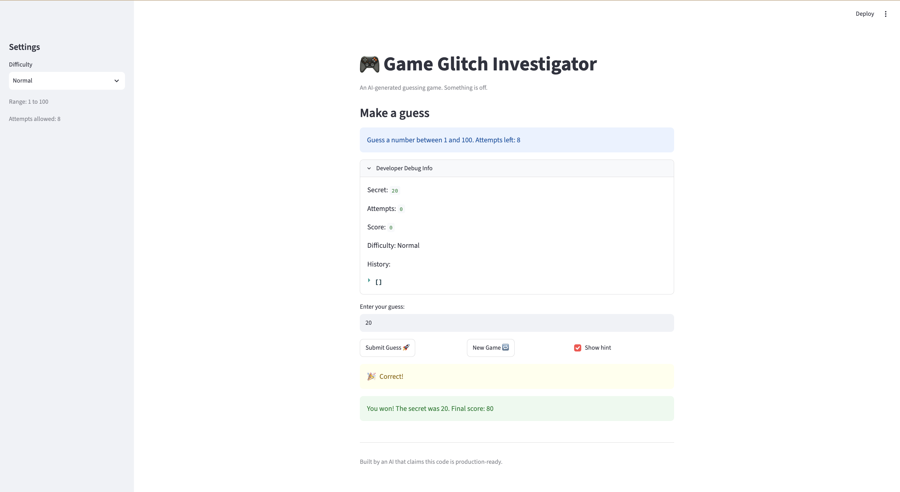

# 🎮 Game Glitch Investigator: The Impossible Guesser

This project is a Streamlit number guessing game that I debugged and tested. I fixed several logic and game state bugs, moved the guessing logic into a separate file, and verified the final version using pytest and manual testing.

## 🚨 The Situation

You asked an AI to build a simple "Number Guessing Game" using Streamlit.
It wrote the code, ran away, and now the game is unplayable. 

- You can't win.
- The hints lie to you.
- The secret number seems to have commitment issues.

## 🛠️ Setup

1. Install dependencies: `pip install -r requirements.txt`
2. Run the broken app: `python -m streamlit run app.py`

## 🕵️‍♂️ Your Mission

1. **Play the game.** Open the "Developer Debug Info" tab in the app to see the secret number. Try to win.
2. **Find the State Bug.** Why does the secret number change every time you click "Submit"? Ask ChatGPT: *"How do I keep a variable from resetting in Streamlit when I click a button?"*
3. **Fix the Logic.** The hints ("Higher/Lower") are wrong. Fix them.
4. **Refactor & Test.** - Move the logic into `logic_utils.py`.
   - Run `pytest` in your terminal.
   - Keep fixing until all tests pass!

## 📝 Document Your Experience

1. The higher and lower hints were backwards. If I guessed above the secret number, the game told me to go higher instead of lower.
2. The game ended one attempt too early and revealed the final score and secret number while one attempt was still shown.
3. After losing, clicking the New Game button did not correctly reset the game.
4. During debugging, the secret number was sometimes converted into a string, which caused an error when it was compared to an integer.

I also checked whether the secret number changed after every guess using the Developer Debug Info. In my version of the game, the secret number stayed the same, so I did not count that as one of my reproduced bugs.

- Corrected the higher/lower hint messages.
- Changed the attempt count so the player gets the full number of guesses.
- Reset the game status, score, attempts, history, and secret number when New Game is pressed.
- Kept the secret number as an integer so it could be compared correctly.
- Moved `check_guess()` into `logic_utils.py` so it could be tested separately.
- Updated the pytest tests to check both the outcome and hint message returned by `check_guess()`.

## 📸 Demo Walkthrough

1. Start the Streamlit app and select a difficulty.
2. Enter a number lower than the secret number. The game correctly tells the player to go higher.
3. Enter a number higher than the secret number. The game correctly tells the player to go lower.
4. Continue guessing until the correct number is entered or all attempts are used.
5. Click New Game after the round ends. The score, attempts, history, game status, and secret number reset for a new round.
6. Run the pytest tests to confirm the guessing logic works correctly.

**Screenshot** *(optional)*: <!-- Insert a screenshot of your fixed, winning game here -->

## 🧪 Test Results

```
# Paste your pytest output here, e.g.:
# pytest tests/
========================================================================= test session starts ==========================================================================
platform darwin -- Python 3.14.0, pytest-9.1.1, pluggy-1.6.0
rootdir: /Users/user/Downloads/AI 101 project/ai110-module1show-gameglitchinvestigator-starter
plugins: anyio-4.15.1
collected 3 items                                                                                                                                                      

tests/test_game_logic.py ...                                                                                                                                     [100%]

========================================================================== 3 passed in 0.01s ===========================================================================

## 🚀 Stretch Features

- [ ] [If you choose to complete Challenge 4, describe the Enhanced UI changes here — a screenshot is optional]
